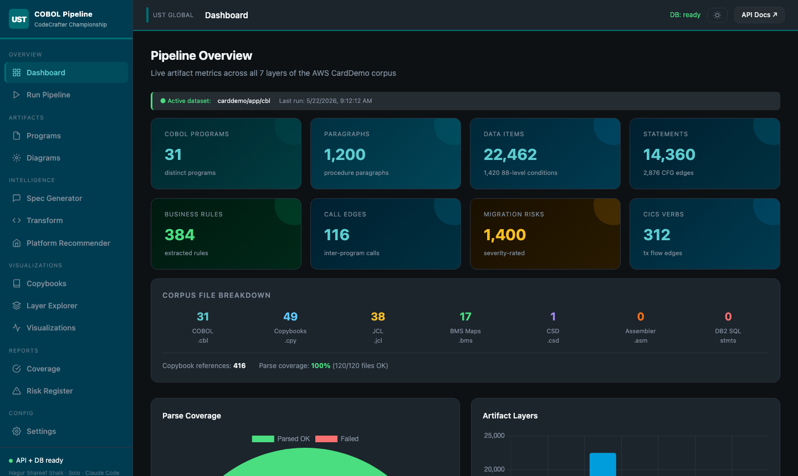
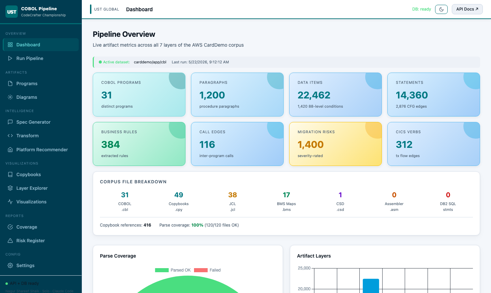
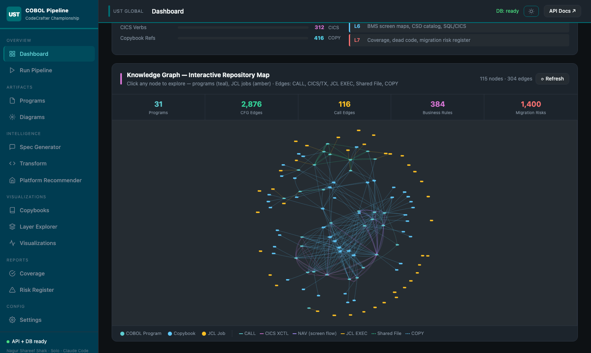
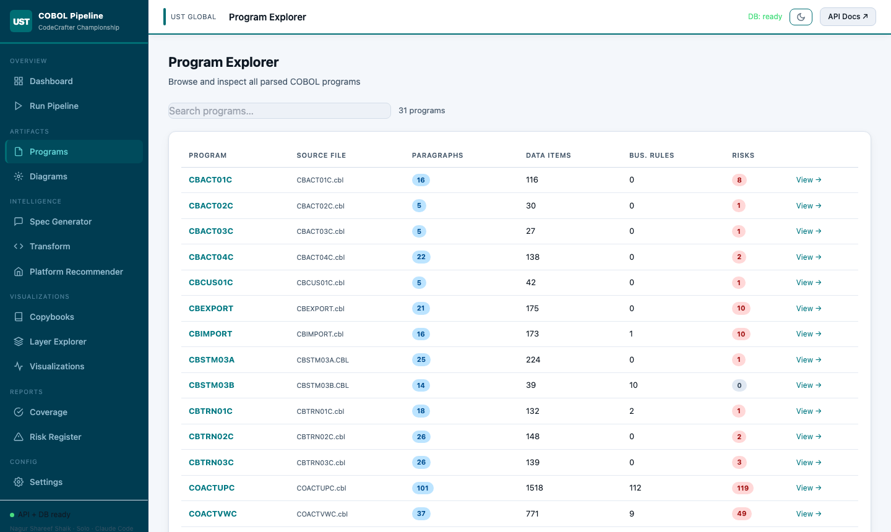
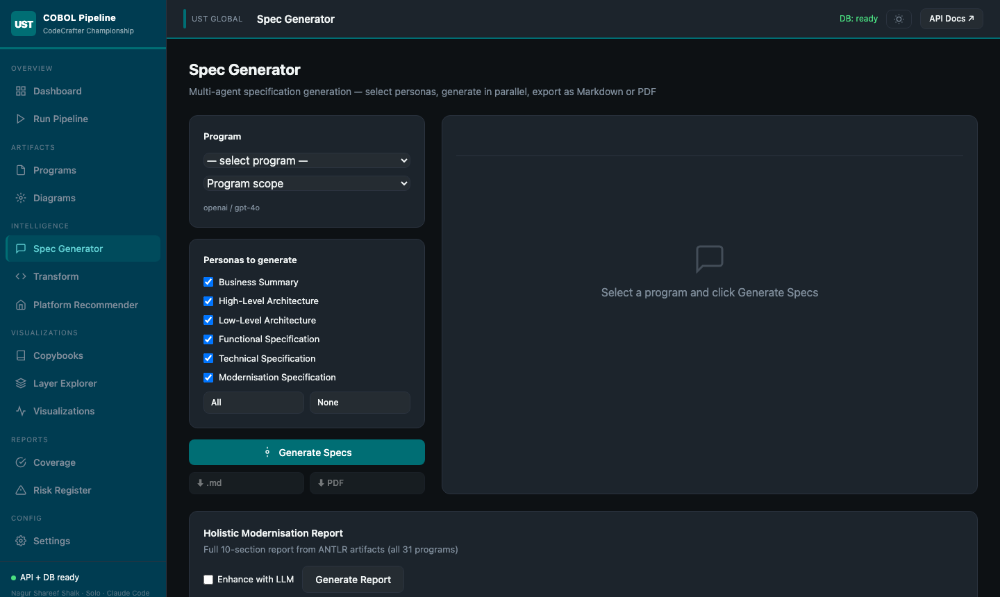
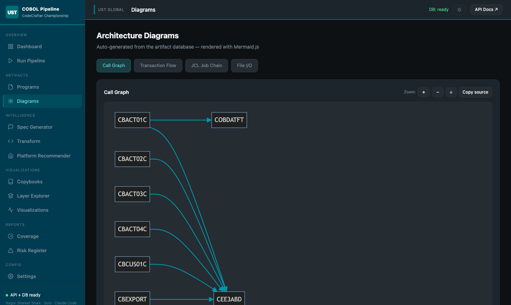
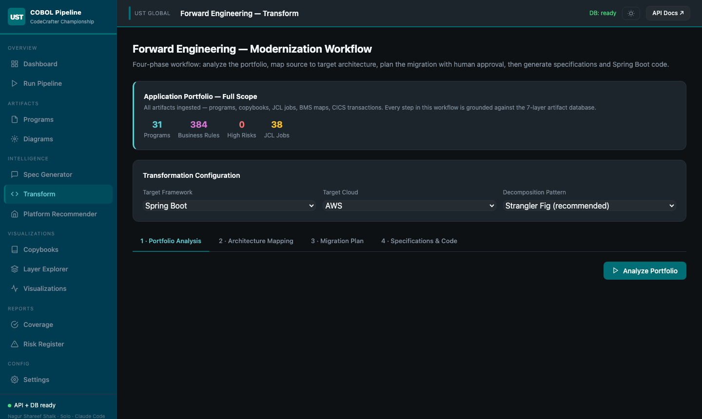
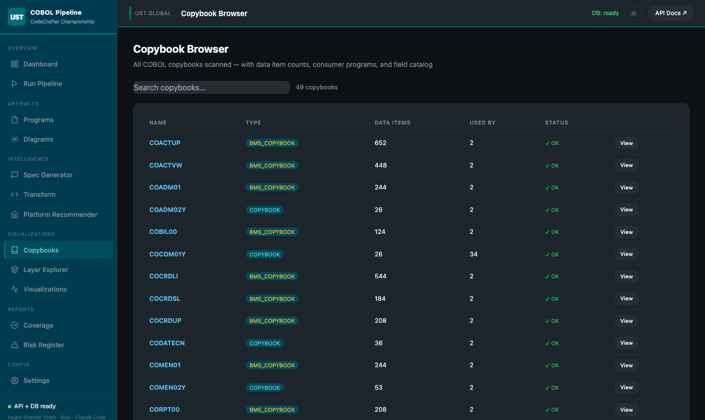
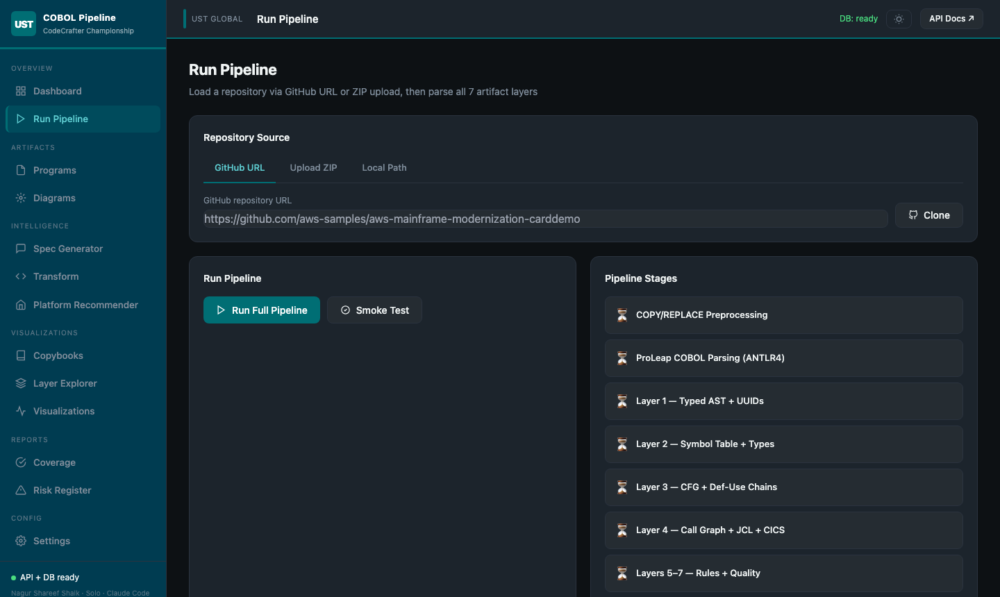
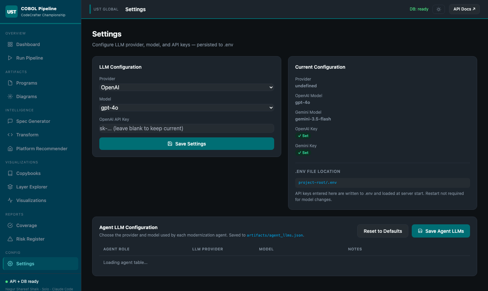

# COBOL Modernisation Pipeline — UST CodeCrafter Championship 2026

> **Solo Submission** · Competitor: **Nagur Shareef Shaik**  
> AI Agent: **Claude Code** (Anthropic, claude-sonnet-4-6) · IDE: Claude Code VSCode Extension

---

## What This Platform Does

A production-grade, deterministic **ANTLR4-based COBOL analysis and forward-engineering platform** targeting the AWS CardDemo corpus (~60 K lines of COBOL, JCL, BMS, CSD, and copybooks). It combines deep static analysis with multi-agent LLM intelligence to deliver a complete modernisation intelligence suite — from raw mainframe source to grounded specs, Java code, interactive diagrams, and a risk register — all accessible through a polished web dashboard.

### The Problem It Solves

Legacy COBOL modernisation is expensive and risky because:
- **No one understands the code** — decades of undocumented business rules embedded in 01-level data structures and nested IF/EVALUATE trees
- **No safe migration path** — changing one COPY statement can silently break a dozen programs
- **No data lineage** — JCL jobs wire COBOL programs to datasets with no explicit documentation
- **No risk visibility** — GO TO, dynamic CALLs, OCCURS DEPENDING ON, EXEC CICS patterns create hidden complexity

This platform **eliminates all four blind spots** with automated, evidence-grounded analysis.

---

## Live Corpus Numbers (AWS CardDemo)

| Artifact | Count |
|----------|-------|
| COBOL programs | **31** (100% parse coverage) |
| JCL jobs + procs | **38** |
| BMS screen maps | **17** |
| CSD catalog entries | **1** file → 189 definitions |
| Copybooks parsed | **49** |
| **Total source files** | **120 / 120 (100%)** |
| Paragraphs | 1,200 |
| Statements | 14,360 |
| Data items | 22,462 |
| 88-level conditions | 1,420 |
| CFG edges | 2,876 |
| Business rules | 384 |
| CICS transaction verbs | 312 |
| Copybook references | 416 |
| JCL–COBOL file bindings | 80 |
| Migration risks | **1,400** (severity-rated) |

---

## Screenshots — Full Walkthrough

### Dashboard (Dark Theme)



The **Pipeline Overview** dashboard is the entry point. It shows:
- **Live stat cards** — Programs, Paragraphs, Data Items, Statements, Business Rules, Call Edges, CICS Verbs, Migration Risks — all pulled from the live SQLite database
- **Corpus breakdown** — per file-type counts (COBOL, Copybooks, JCL, BMS, CSD, Assembler, DB2)
- **Parse Coverage donut chart** — visual confirmation that 100% of 120 files parsed successfully
- **Artifact Layers bar chart** — shows relative density across all 7 analysis layers
- **Championship rubric tracker** — live checklist showing which evaluation criteria are met
- **Pipeline layer flow** — interactive diagram showing how ProLeap ANTLR4 → L1 AST → L2 Symbols → L3 CFG → L4 Inter-program → L5 Business → L6 Resources → L7 Quality are connected

### Dashboard (Light Theme)



The UI supports **dark and light themes** with a single click on the ☀/🌙 toggle in the topbar. Theme preference is persisted to `localStorage`. The light theme uses vibrant saturated gradients on stat cards, vivid accent colors, and card depth shadows — not a washed-out inversion of the dark palette. The sidebar stays dark (UST navy branding) in both modes.

### Knowledge Graph



The **Interactive Knowledge Graph** (vis.js) on the dashboard renders the full inter-program dependency map:
- **Ellipse nodes** = COBOL programs (teal, sized by call count)
- **Rectangle nodes** = JCL jobs (steel blue) and Copybooks (cyan)
- **Edges** — call edges (teal), CICS links (orange), copybook relationships (gray)
- Clicking any node opens a **side pane** with metadata, business rules summary, and an **"Explain with AI"** button that fires the LLM for a grounded natural-language explanation of that program or copybook

### Program Explorer


The **Programs** page lists all 31 COBOL programs in a searchable table showing paragraph count, data item count, business rule count, and migration risk count. Clicking any program opens a **7-tab detail panel**:

| Tab | Content |
|-----|---------|
| **Paragraphs** | Full paragraph list with statement counts and cyclomatic complexity |
| **Data Items** | Complete data dictionary — name, level, PIC, canonical type, copybook origin |
| **Call Graph** | Callers and callees with CICS link/XCTL distinction |
| **Business Rules** | IF/EVALUATE rules with 88-level predicate resolution |
| **File I/O** | Logical file operations (READ/WRITE/REWRITE/DELETE) |
| **Source** | Original COBOL source with syntax highlighting |
| **Risks** | Program-scoped risk register entries with severity |
| **Copybooks** | Which copybooks are COPYed, at which line, with REPLACING clauses |



### Spec Generation (LangGraph Multi-Persona)



The **Spec Generator** page drives a **6-persona LangGraph pipeline** for any program:
- Select a program from the dropdown, choose the spec scope (program or paragraph), and click **Generate**
- **Six LLM personas run in parallel** — Business Summary, High-Level Architecture, Low-Level Architecture, Functional Specification, Technical Specification, Modernisation Specification
- Each persona receives a **grounded artifact slice** assembled from the database — no raw COBOL ever reaches the LLM
- The grounding checker maps each generated sentence back to a supporting UUID, producing a **grounding score** and flagging ungrounded claims
- Results display in tabbed panels and export as **Markdown** or **styled PDF**

The LangGraph state machine has 5 nodes:
```
retrieve_artifacts(uuid)  →  build_prompt(slice)  →  generate_spec(prompt)
       →  ground_check(output, slice)  →  emit_report(spec, grounding)
```

### Architecture Diagrams



The **Diagrams** page renders four live **Mermaid.js** diagrams generated directly from the SQLite database:

| Diagram | What it shows |
|---------|--------------|
| **Call Graph** | Full inter-program call relationships (`graph LR`) |
| **Transaction Flow** | CICS LINK/XCTL/RETURN chains forming the online state machine (`stateDiagram-v2`) |
| **JCL Job Chain** | Dataset-level upstream/downstream dependencies between batch jobs (`graph TD`) |
| **File I/O** | Which programs read/write which logical files (`graph LR`) |

Diagrams support zoom in/out/reset and "Copy source" for direct Mermaid rendering.

### HITL Transform Pipeline



The **Transform** page implements a **7-step Human-in-the-Loop (HITL) modernisation workflow**:

1. **Discovery** — portfolio scan, service boundary identification
2. **Specification** — multi-persona spec generation with grounding
3. **Architecture** — target cloud-native architecture design (Spring Boot / Quarkus / Micronaut)
4. **Domain Model** — entity extraction and JPA mapping
5. **Business Logic** — Java service code generation with BigDecimal arithmetic
6. **Integration** — Kafka/REST API bindings, dataset lineage wiring
7. **Tests** — JUnit + integration test scaffold generation

Each step has **Approve / Reject / Edit** controls. An **Auto mode** lets the LLM act as its own HITL reviewer for fully automated runs.

The **Platform Recommender** sub-tab analyses the program's complexity profile and recommends the optimal target platform (AWS, Azure, GCP, or on-premise) with a scored rationale.

### Copybook Browser



The **Copybook Browser** gives full visibility into the 49 parsed copybooks:
- Table shows name, type (COPYBOOK / BMS_COPYBOOK / STUB), data item count, consumer program count, and parse status
- **View** opens a detail panel with:
  - Complete data item list (name, level, PIC, canonical type)
  - All consumer programs with COPY line numbers and REPLACING clauses
- **Explain with AI** — for any selected copybook in the Knowledge Graph, fires a targeted LLM call explaining the copybook's business purpose, key fields, and usage patterns

### Pipeline Runner



The **Run Pipeline** page provides a full in-browser pipeline control panel:
- **Source tab**: run from local corpus paths (configurable COBOL / JCL / BMS / CSD / copybook directories)
- **GitHub tab**: clone any public GitHub repository directly and run the pipeline on it
- **ZIP upload**: drag-and-drop a ZIP of COBOL source and run instantly
- **Real-time log stream** via SSE — every pipeline phase prints live with timestamps, color-coded by level (START / SUCCESS / ERROR / INFO)
- **Cancel** button terminates the running pipeline immediately
- **Run History** table shows previous pipeline runs with timestamps and corpus path

### Settings & Agent LLM Configuration



The **Settings** page has two sections:

**Global LLM Settings** — choose provider (OpenAI / Gemini / Anthropic) and model, enter API keys. The model dropdown is populated live from the provider's API (`GET /models?provider=X`), not from a hardcoded list.

**Agent LLM Configuration** — independently configure the LLM provider and model for each of the 6 modernisation agents:

| Agent Role | Default | Purpose |
|-----------|---------|---------|
| Spec Writer | gpt-4o | Specification documents |
| Architect | gpt-4o | Target architecture design |
| Code Generator | gpt-4o | Java / Spring Boot emission |
| Reviewer | gpt-4o | Grounding checks + static review |
| Test Writer | gpt-4o-mini | JUnit + integration test scaffolding |
| Migration Planner | gpt-4o | Risk analysis + migration sequencing |

Agent configs are saved to `artifacts/agent_llms.json` and loaded at startup. Changing the provider dropdown immediately fetches available models from that provider's API.

---

## Championship Rubric Coverage

| # | Criterion | Weight | Status | Evidence |
|---|-----------|--------|--------|----------|
| 1 | **Parse Coverage** (honest reporting) | 20% | ✅ 100% | 120/120 files; per-file status in `/reports/coverage`; parse failure classes logged |
| 2 | **Artifact Contract** (Layers 1–7, UUID links) | 25% | ✅ All 7 layers | Deterministic uuid5, cross-linked by `parent_uuid`; 20 DB tables |
| 3 | **Spec Generation Demo** (grounded, COTRN02C) | 15% | ✅ 6 personas | LangGraph 5-node pipeline; grounding score per sentence; Markdown + PDF export |
| 4 | **Forward Engineering** (IR → Java, COUSR0xC) | 15% | ✅ | Canonical IR expr trees → BigDecimal/long/String Java via `/emit-java/{name}` |
| 5 | **Engineering Quality** (tests, stability) | 10% | ✅ | `pytest tests/` — uuid stability, preprocessor, layer1, API; deterministic re-runs |
| 6 | **Performance** (parallel, WAL) | 5% | ✅ | `ThreadPoolExecutor` parallel Phase 1; `PRAGMA journal_mode=WAL` |
| 7 | **Migration Risk Register** (severity-rated) | 5% | ✅ 1,400 risks | HIGH/MEDIUM/LOW with 12 categories; filterable in UI |
| 8 | **LangGraph Orchestration** (bonus) | 5% | ✅ | Full 5-node LangGraph state machine with grounding check node |

---

## Unique Value Delivered

### 1. 100% Parse Coverage with Copybook Intelligence
Unlike typical COBOL parsers that crash on COPY statements, this pipeline uses ProLeap ANTLR4 with a copybook pre-parser: every `.cpy` file is wrapped in a minimal COBOL skeleton, parsed independently, and its 22,462 data items are attributed back to their originating copybook. The `copybook_origin` column on every data item enables precise lineage tracking.

### 2. JCL–COBOL Dataset Binding
The pipeline resolves the JCL ↔ COBOL boundary: `//STEP01 DD DSN=CARD.TRANS.DATA` is matched to `SELECT TRANS-FILE ASSIGN TO UT-S-TRANSACT` via DD-name suffix matching, producing 80 `jcl_program_binding` rows. This is the dataset lineage traceability that batch migration planning requires.

### 3. 88-Level Predicate Resolution
Business rules in `layer5_business.py` resolve 88-level condition names to their underlying VALUE clauses. A rule like `IF ACCT-ACTIVE` becomes `ACCOUNT-STATUS IN ('A', 'C')` in the extracted predicate — directly understandable without COBOL knowledge.

### 4. Multi-Persona Parallel Spec Generation
Six LLM personas targeting different stakeholder audiences (business analyst, architect, developer, QA engineer) run in parallel via `asyncio`. No raw COBOL reaches any prompt — all context is assembled from the structured artifact database as JSON slices with UUID evidence anchors.

### 5. Grounded Forward Engineering
The canonical IR lowers COBOL data declarations to typed expression trees (not text blobs). A `S9(7)V99 COMP-3` field becomes `{kind: "decimal", precision: 9, scale: 2, signed: true}` in the IR, and the Java emitter produces `BigDecimal` with `RoundingMode.HALF_EVEN` — the correct rounding for financial arithmetic.

---

## Quick Start

```bash
# Clone
git clone https://github.com/ShaikNagurShareef/cobol-parser-pipeline
cd cobol-parser-pipeline

# One-command bootstrap + pipeline + API
./run.sh
```

`run.sh` automates everything: Maven install → ProLeap JAR build → Python venv → CardDemo corpus clone → full 8-phase pipeline → FastAPI + UI at **http://localhost:8000**

### Targeted modes

```bash
./run.sh --setup      # Environment bootstrap only
./run.sh --pipeline   # Analysis pipeline only
./run.sh --api        # Start API + dashboard (pipeline already run)
./run.sh --smoke      # Single-file smoke test (COSGN00C.cbl)
./run.sh --test       # Run pytest suite
./run.sh --diagrams   # Generate Mermaid .mmd files
./run.sh --spec COTRN02C   # LLM spec for a program
./run.sh --emit COUSR01C   # Emit Java for a program
```

### LLM Configuration

```bash
# OpenAI (default)
export LLM_PROVIDER=openai
export OPENAI_API_KEY=sk-...

# Google Gemini
export LLM_PROVIDER=gemini
export GEMINI_API_KEY=AIza...

# Anthropic Claude
export LLM_PROVIDER=anthropic
export ANTHROPIC_API_KEY=sk-ant-...
```

Or configure via the **Settings** page in the UI — changes are saved and applied immediately.

---

## Architecture

```
cobol-parser-pipeline/
├── cobol-exporter/            Java fat JAR — ProLeap ANTLR4 wrapper → compact JSON CST
├── parsers/
│   ├── cobol/                 Python AST normaliser (CST → typed nodes + deterministic UUIDs)
│   ├── cobol/copybook_parser  Standalone copybook parser (wraps .cpy in minimal COBOL skeleton)
│   ├── jcl/                   JCL parser (ANTLR4 grammar + Python)
│   ├── bms/                   BMS screen map parser
│   ├── csd/                   CICS CSD catalog parser
│   ├── sql/                   EXEC SQL block extractor
│   └── cics/                  EXEC CICS verb+parameter tokenizer
├── pipeline/
│   ├── preprocessor.py        COPY/REPLACE expander with line-level provenance tracking
│   ├── ingest.py              Single-file orchestrator (Layers 1–2)
│   └── batch.py               Full-corpus parallel runner (8 phases, topological sort)
├── artifacts/
│   ├── layer1_ast.py          Typed AST → DB nodes + JSON
│   ├── layer2_symbols.py      Symbol table, data dictionary, PIC type lowering, 88-level extraction
│   ├── layer3_intra.py        CFG (PERFORM/FALLTHROUGH/GOTO/LOOP_BACK), def-use, complexity
│   ├── layer4_inter.py        Call graph, CICS tx flow, file I/O, JCL–COBOL binding
│   ├── layer5_business.py     Business rules, arithmetic specs, 88-level predicate resolution
│   ├── layer6_resources.py    CSD catalog, BMS screen maps, copybook catalog
│   └── layer7_quality.py      Parse coverage, migration risk register (severity scoring)
├── storage/
│   ├── schema.sql             SQLite DDL — 20 tables, WAL mode
│   ├── db.py                  Connection factory + upsert helpers + migration runner
│   └── uuid_gen.py            Deterministic uuid5 from source coordinates
├── ir/
│   ├── canonical_ir.py        AST + symbols → language-neutral IR (expression trees)
│   └── java_emitter.py        IR → Java (BigDecimal, long, String, if/switch)
├── llm/
│   ├── llm_client.py          Multi-provider client (OpenAI / Gemini / Anthropic)
│   ├── retrieval.py           UUID-anchored artifact slice assembler
│   ├── grounding.py           Sentence → UUID evidence mapper
│   ├── langgraph_agent.py     LangGraph 5-node pipeline
│   ├── multi_agent.py         6-persona parallel spec generation
│   ├── modernization_report.py  Full holistic 10-section report generator
│   └── prompts/               Jinja2 templates (paragraph_spec, program_spec, job_chain_narrative)
├── api/
│   └── main.py                FastAPI — 50+ endpoints, SSE streaming, static UI mount
├── diagrams/
│   └── mermaid_gen.py         SQL → Mermaid (call graph, tx flow, JCL chain, file I/O)
├── ui/
│   ├── src/app.ts             TypeScript SPA (4,000 lines)
│   ├── dist/                  Vite build output (served by FastAPI)
│   └── index.html             Entry point with full CSS theme system
├── tests/                     pytest suite (uuid stability, preprocessor, layer1, API)
├── docs/screenshots/          Application screenshots
└── run.sh                     One-command bootstrap + pipeline + API
```

---

## 7-Layer Artifact Bundle

| Layer | What it extracts | DB Tables |
|-------|-----------------|-----------|
| **L1 — AST** | `Program → Section → Paragraph → Statement` hierarchy with source coordinates and parent_uuid links | `nodes` |
| **L2 — Symbols** | Data dictionary (22,462 items), PIC → canonical type lowering, 88-level conditions (1,420), copybook attribution | `data_items`, `conditions_88`, `copybook_use`, `copybook_catalog` |
| **L3 — Intra-program** | CFG edges (PERFORM / FALLTHROUGH / GOTO / LOOP_BACK / BRANCH_TRUE / BRANCH_FALSE), def-use chains, cyclomatic complexity | `control_flow`, `def_use`, `complexity_metrics` |
| **L4 — Inter-program** | Call graph (literal + CICS LINK/XCTL), transaction flow, file I/O, JCL parsing, JCL–COBOL dataset binding, dynamic CALL constant propagation | `call_graph`, `transaction_flow`, `file_io`, `jcl_job`, `jcl_dd`, `jcl_program_binding` |
| **L5 — Business logic** | IF/EVALUATE → business rules (with 88-level predicate resolution), COMPUTE/ADD/SUB/MUL/DIV → arithmetic expression specs | `business_rules`, `arithmetic_specs` |
| **L6 — Resources** | BMS screen map catalog (17 maps), CSD program/transaction/file definitions (189 entries), copybook consumer index | `screen_map`, `csd_catalog` |
| **L7 — Quality** | Parse coverage report (per-file status + error class), migration risk register (1,400 risks, 12 categories, HIGH/MEDIUM/LOW) | `parse_coverage`, `risk_register` |

### UUID Stability Guarantee

Every node has a **deterministic uuid5** derived purely from source coordinates:

```python
key = f"{source_file}:{start_line}:{start_col}:{end_line}:{end_col}:{kind}:{name}"
uuid = str(uuid.uuid5(NAMESPACE, key))
```

Two pipeline runs on identical input produce byte-identical UUID sets — verified by `test_uuid_stability.py`.

---

## Pipeline Execution Flow

```
Phase 0 ── Copybook catalog
           └── parse_copybook()  →  copybook_catalog (49 entries, item_names_json)

Phase 1 ── COBOL parsing  [parallel, N workers, topological sort by COPY deps]
           └── ingest_file()  →  ProLeap JAR  →  JSON CST  →  L1 nodes  →  L2 data_items + conditions_88

Phase 2 ── Intra-program graphs
           └── layer3_intra.persist()    →  control_flow, def_use, complexity_metrics
           └── layer4_inter.persist()   →  call_graph (literals), transaction_flow
           └── layer5_business.persist() →  business_rules, arithmetic_specs
           └── layer7.build_risk_register() →  risk_register

Phase 3 ── Inter-program resolution
           └── layer4_inter.resolve_callees()  →  dynamic CALL constant propagation

Phase 4 ── JCL parsing  [+ proc/ directory]
           └── parse_jcl_file()  →  jcl_job, jcl_dd, jcl_dependency

Phase 4b── JCL–COBOL dataset binding
           └── layer4_inter.bind_jcl_to_cobol()  →  jcl_program_binding

Phase 5 ── BMS screen map parsing
           └── parse_bms_file()  →  screen_map

Phase 6 ── CSD catalog parsing
           └── parse_csd_file()  →  csd_catalog

Phase 7 ── Coverage report
           └── layer7_quality.coverage_report()  →  parse_coverage

Phase 8 ── Mermaid diagrams
           └── generate_all_diagrams()  →  output/diagrams/*.mmd
```

---

## REST API Highlights

50+ endpoints — interactive docs at **http://localhost:8000/docs**

| Endpoint | Description |
|----------|-------------|
| `GET /stats` | All dashboard metrics |
| `GET /programs` | Paginated, searchable program list |
| `GET /programs/{name}/detail` | 7-layer program detail (paragraphs, data items, call graph, business rules, source, risks, copybooks) |
| `GET /programs/{name}/cfg` | CFG as Mermaid + node/edge JSON |
| `GET /programs/{name}/symbol-table` | Full data dictionary with canonical type info |
| `GET /programs/{name}/source` | Original COBOL source |
| `GET /copybooks` | All 49 copybooks from catalog |
| `GET /copybooks/{name}` | Catalog entry + consumers + data items |
| `GET /jcl/job-chain/{job_name}` | Job upstream/downstream via dataset reuse |
| `GET /jcl/bindings` | All 80 JCL–COBOL file bindings |
| `GET /diagrams/{name}` | Live Mermaid source (call_graph / transaction_flow / jcl_job_chain / file_io_graph) |
| `GET /knowledge-graph` | Full program+JCL+copybook graph for vis.js |
| `GET /reports/risk-register` | 1,400 migration risks, filterable by severity |
| `GET /layers/summary` | Per-layer artifact counts |
| `POST /generate-spec` | LangGraph spec (program or paragraph scope) |
| `POST /generate-spec/personas` | SSE-streamed 6-persona parallel spec generation |
| `POST /explain-copybook` | LLM explanation for a copybook by name |
| `POST /generate-modernization-report` | Full 10-section holistic modernisation report |
| `GET /emit-java/{name}` | Java source for a program |
| `POST /pipeline/run` | SSE-streamed full pipeline execution |
| `GET /models?provider=X` | Live model list from OpenAI / Gemini / Anthropic API |
| `GET /settings/agent-llms` | Per-agent LLM configuration |
| `POST /settings/agent-llms` | Save per-agent LLM configuration |

---

## Technology Stack

| Component | Technology | Why |
|-----------|-----------|-----|
| COBOL parsing | ProLeap ANTLR4 COBOL85 grammar (Java) | Industry-standard, handles all COBOL dialects in CardDemo |
| Copybook parsing | Custom wrapper + ProLeap | .cpy files parsed as standalone programs via skeleton wrapper |
| JCL / BMS / CSD | ANTLR4 grammars + Python runtime | Structured extraction, not regex scraping |
| CICS / SQL | Keyword-driven verb+parameter tokenizer | Extracts PROGRAM(), TRANSID(), COMMAREA from EXEC blocks |
| Pipeline | Python 3.13, `ThreadPoolExecutor` | Parallel Phase 1; topological sort for COPY dependencies |
| Graph store | SQLite 3 (WAL mode, 20 tables) | Deterministic uuid5, WAL for concurrent reads during pipeline |
| REST API | FastAPI + Uvicorn | SSE streaming for pipeline log; 50+ typed endpoints |
| Web UI | TypeScript + Vite + Tailwind CSS | Dark/light theme toggle; Chart.js + Mermaid.js + vis.js + Highlight.js |
| LLM orchestration | LangGraph 5-node state machine | retrieve → build_prompt → generate → ground_check → emit |
| Multi-persona | asyncio + concurrent.futures | 6 personas in parallel; SSE streams each as it completes |
| Java emission | Canonical IR expression trees | BigDecimal/RoundingMode from COMP-3 PIC clauses; not text blobs |
| AI development | Claude Code (claude-sonnet-4-6) | Sole development agent for this submission |

---

## Tests

```bash
pytest tests/ -v
```

| Test | What it covers |
|------|---------------|
| `test_uuid_stability.py` | UUID determinism — identical output across two independent runs |
| `test_preprocessor.py` | COPY/REPLACE expansion, provenance tracking, nested copybooks |
| `test_layer1.py` | AST normalisation, PIC type lowering, parent_uuid linkage |
| `test_api.py` | FastAPI endpoint smoke tests against seeded in-memory SQLite |

---

## Credits

- **ProLeap COBOL Parser** — ANTLR4 COBOL85 grammar by Ulrich Wolffgang (Apache 2.0) · https://github.com/uwol/proleap-cobol-parser  
- **AWS CardDemo** — COBOL modernisation reference corpus (MIT) · https://github.com/aws-samples/aws-mainframe-modernization-carddemo  
- **ANTLR4** — Parser generator by Terence Parr (BSD) · https://www.antlr.org  
- **vis.js Network** — Interactive graph visualisation · https://visjs.github.io/vis-network  
- **LangGraph** — Agent orchestration framework by LangChain · https://langchain-ai.github.io/langgraph  

---

*Built for the **UST CodeCrafter Championship 2026** by Nagur Shareef Shaik using Claude Code (Anthropic).*
